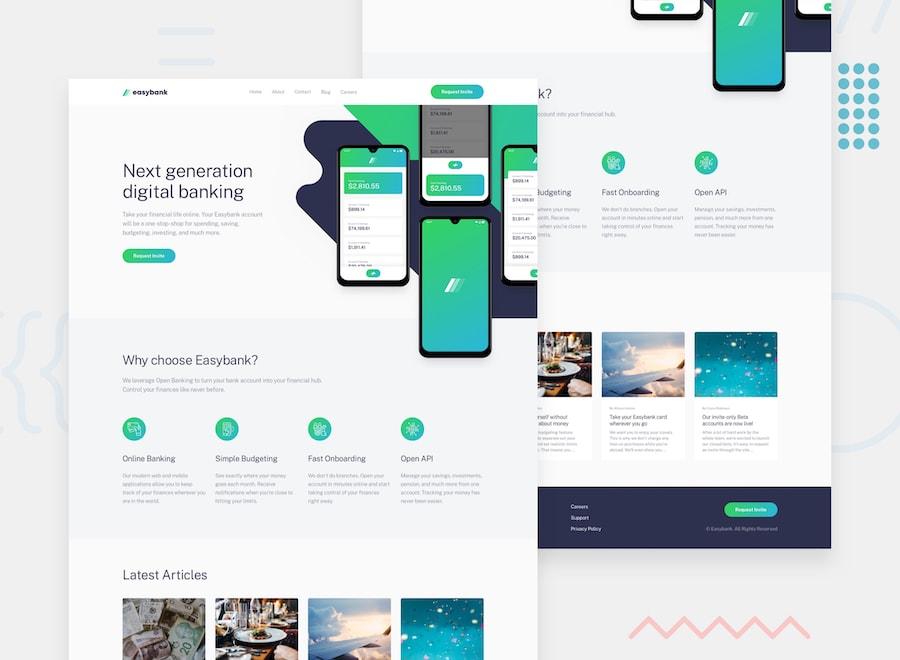

# Frontend Mentor - Easybank landing page

### Built with 🧱
- Semantic HTML5 markup
- SCSS
- JS
- Flexbox
- @media

### Links 🌐

- Live Site URL 🔴: [click!](https://kacperkwinta.github.io/Easybank-landing-page/)
- My Frontend Mentor profile 👦: [click!](https://www.frontendmentor.io/profile/kacperkwinta)
